# Corso HTML5

Impariamo a usare HTML5 conoscendone le basi


<!-- _paginate: false -->
<!-- _footer: "" -->
<!-- style: "
img[alt~='center'] {
  display: block;
  margin: 0 auto;
}
h2 {
    color: #e50000;
    position: absolute;
    top: 30px;
}
" -->

---

## Scopo del corso

Queste slide nascono dalla mia curiosità verso HTML5 e dall'esperienza che ho accumulato nel corso degli anni.

La struttura base del corso ripercorre i passi seguiti da w3schools, li arricchisce con nuovi esempi ed una serie di slide in italiano.

---

## HTML

__Hyper Text Markup Language__

Cos'è HTML?

- È il linguaggio standard per la creazione di pagine web tramite marcatori.
- Il suo scopo è quello di descrive la struttura delle pagine.
- Identifica una serie di elementi strutturati.
- La sua interpretazione necessita di un browser.

---

## HTML – strumenti

Il portale che useremo durante il corso è

[https://codepen\.io](https://codepen.io/)

_CodePen is a social development environment. At its heart\, it allows you to write code in the browser, and see the results of it as you build. A useful and liberating online code editor for developers of any skill\, and particularly empowering for people learning to code. We focus primarily on front-end languages like HTML, CSS, JavaScript, and preprocessing syntaxes that turn into those things._

Iscrivetevi e seguite il profilo creato apposta per il corso

[https://codepen\.io/matteobaccan](https://codepen.io/matteobaccan)

---

## HTML – editor

Editor

Codepen.io
Notepad
Notepad++
VisualStudio Code

Va bene qualsiasi editor\, non visuale\, meglio se con syntax highlighter e code completion

Le slide e i sorgenti del corso\, liberamente ispirati a [https://www\.w3schools\.com](https://www.w3schools.com/) e costantemente aggiornati\, sono disponibili a questo indirizzo

[https://github\.com/matteobaccan/CorsoHTML](https://github.com/matteobaccan/CorsoHTML)

---

## Browser

I browser sono dei programmi necessari alla corretta visualizzazione di una pagina HTML.

Esempi di browser sono:

    - Chrome
    - Firefox
    - Edge
    - Safari
    - Opera

Senza i browser non sarebbe possibile visualizzare le pagine web, vista anche la loro complessità e natura dinamica.

---

## Com'è fatto un browser?

Un browser è composto da una serie di componenti che permettono la visualizzazione delle pagine HTML.

__Browser engine__: address bar, pulsanti di navigazione, viewport, print
__Rendering engine__: chiama la rendering engine per visualizzare il contenuto richiesto
__Javascript interpreter__: interpreta il codice javascript
__Networking__: HTTP requests, SSL, etc
__UI backend__: disegna i widget nativi come alert, form di caricamento file etc

---

## Componenti del browser


---

## Flusso di richiesta

- Inserimento dell'indirizzo di destinazione
- Risoluzione dell'indirizzo via DNS
- Verifica della presenza in cache della pagina/risorsa
- Eventuale download
- Gestione del codice d'errore
- Rendering della pagina

---

## Gestione delle richieste

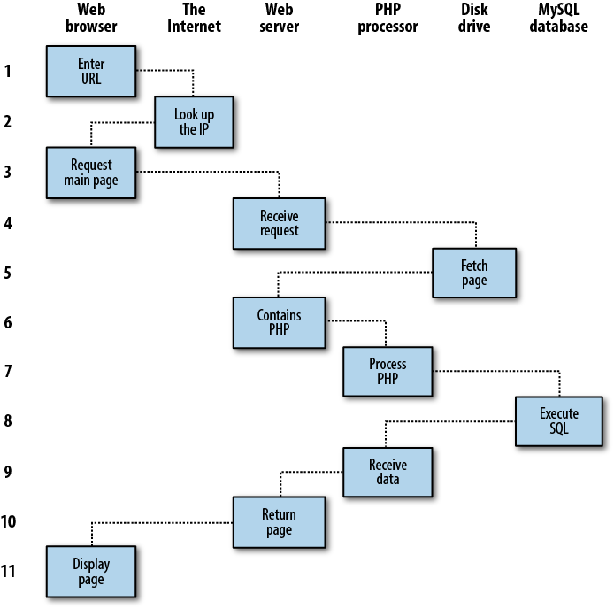

<https://www.oreilly.com/library/view/learning-php-mysql/9781449337452/ch01s01.html>

---

## Rendering delle pagine

Il rendering è quel processo che permette di visualizzare una pagina HTML.

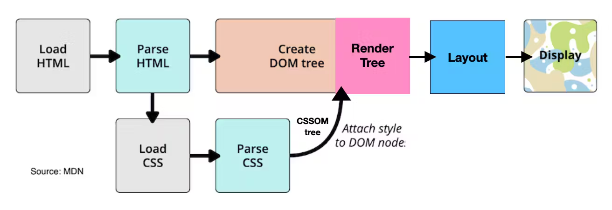

---

## HTML - esempio minimo di pagina HTML

```html
<!DOCTYPE html>

<html lang="it">

    <head>
        <title>Titolo della pagina</title>
    </head>

    <body>
        <h1>Intestazione</h1>
        <p>Lorem ipsum dolor sit amet, consectetur adipiscing elit.</p>
    </body>

</html>
```

---

## HTML - Elementi - TAG

Le pagine HTML sono composte da una serie di elementi, chiamati TAG, formattatine nel seguente modo:

```html
<nometag> contenuto </nometag>
```

Un tag è identificato da una sequenza di caratteri, con una sintassi di apertura e chiusura

All’interno del tag viene poi inserito il suo contenuti, che a sua volta potrebbe essere del testo o altri tag

---

## HTML - Elementi - empty TAG

Empty TAG

```html
<br> <hr> 
```

Sono tag pensati per non avere un corpo\.

In base al fatto che siano usati come HTML5 o XHTML5 potrebbero essere scritti in formato diverso

```html
<br/> <hr/> 
```

---

## HTML – attributi

Attributi

```html
<a href="https://www.baccan.it">Visitate Baccan.it</a>
```

I tag HTML possono avere degli attributi\.

Gli attributi aggiungono delle informazioni ai tag

La loro struttura è per __chiave__ = __"valore"__

---

## HTML – definizione

    <!DOCTYPE html>

Identifica il fatto che il documento sia in formato HTML5

---

## HTML primo tag

    <html lang="it">

    ...

    </html>

É il primo elemento di una pagina html\, all’interno di questo  elemento è contenuta la struttura della pagina

---

## HEAD

    <head>

    ...

    </head>

È il tag che contiene le informazioni inerenti alla pagina

\- Titolo

\- Descrizione

\- Tag per motori di ricerca

\- Tag per Social Network

---

## HEAD - esempio

    <head>

    <title>Titolo della pagina</title>

    </head>

È il titolo della pagina: viene visualizzato all’interno del browser per dare un nome al tab che state visualizzando o dai motori di ricerca per rappresentare la vostra pagina

---

## BODY

    <body>

    ...

    </body>

Definisce il corpo della pagina html: testi\, paragrafi\, immagini\, link\, tabelle etc

---

## BODY - Intestazione

    <body>

        <h1>Intestazione</h1>

    </body>

È il primo degli heading disponibili in HTML5

---

## BODY - esempio

    <body>

        <p>Lorem ipsum dolor sit amet, consectetur adipiscing elit.</p>

    </body>

Definisce un paragrafo

---

## Heading

    <h1>Intestazione 1</h1>

    <h2>Intestazione 2</h2>

    <h3>Intestazione 3</h3> 

Questo tipo di tag sono intestazioni

Hanno 6 livelli di profondità e servono per intestare nel modo corretto delle parti di pagina\. Il loro utilizzo è utilizzato dai motori di ricerca per determinare delle parti importanti di pagina

---

## Heading size

Le dimensioni di default dei __font-size__ degli heading sono

h1 - 2em
h2 - 1.5em
h3 - 1.17em
h4 - 1em
h5 - .83em
h6 - .67em

dove em deriva dalla parola "emphasis" e identifica una larghezza relativamente al carattere corrente.
Se il carattere corrente è di 16px il valore di 2em identifica 32px
Come peso viene invece assegnato un __font-weight: bolder__

---

## Style

L’attributo  __style__  viene utilizzato per assegnare un stile ad un determinato tag

    <h1 style="color:red;">Intestazione</h1>

    <h2 style="color:blue;">Intestazione</h2>

    <h3 style="color:yellow;">Intestazione</h3>

Ad esempio per cambiare il colore del carattere di un testo

---

## Formattazione

    <b> - Grassetto
    <strong> - Importante
    <i> - Italico
    <em> - Enfatizzato
    <mark> - Marked
    <small> - Smaller
    <del> - Cancellato
    <ins> - Inserted
    <sub> - Subscript
    <sup> - Superscript

---

## Citazioni

Esistono alcuni elementi utilizzati per poter fare delle citazioni

    <abbr>          Defines an abbreviation or acronym

    <address>       Defines contact information for the author/owner of a document

    <bdo>           Defines the text direction

    <blockquote>    Defines a section that is quoted from another source

    <cite>          Defines the title of a work

    <q>             Defines a short inline quotation

---

## Commenti

Esiste la possibilità di inserire del testo che verrà scartato in automatico del browser\. Lo scopo del commento è puramente documentativo\.

    <!-- Questo è un commento -->

    <p>Questo è un paragrafo</p>

---

## Colori

In HTML esistono 140 colori standard che possono essere chiamati per nome

<https://www.w3schools.com/colors/colors_names.asp>

Ad ognuno è associata una sequenza RGB

---

## Colori - sfondo, testo e bordo

I colori possono essere usati in vari contesti\, come colore di sfondo\, colore di testo o di bordo

    <h1 style="background-color:DodgerBlue;">Intestazione</h1>
    <p style="background-color:Tomato;">Paragrafo</p>

    <h1 style="color:Tomato;">Intestazione </h1>
    <p style="color:DodgerBlue;">Paragrafo</p>
    <p style="color:MediumSeaGreen;">Paragrafo</p>

    <h1 style="border:2px solid Tomato;">Intestazione</h1>
    <h1 style="border:2px solid DodgerBlue;">Intestazione</h1>
    <h1 style="border:2px solid Violet;">Intestazione</h1>

---

## Colori - varianti

I colori possono essere indicati in vari formati RGB, HEX, HSL, RGBA e HSLA

    <h1 style="background-color:rgb(255, 99, 71);">...</h1>
    <h1 style="background-color:#ff6347;">...</h1>
    <h1 style="background-color:hsl(9, 100%, 64%);">...</h1>

    <h1 style="background-color:rgba(255, 99, 71, 0.5);">...</h1>
    <h1 style="background-color:hsla(9, 100%, 64%, 0.5);">...</h1>

---

## Colori - RBG

Un colore RGB rappresenta le tre componenti di luce RED\, GREEN e BLUE

I colori RGBA sono una estensione di RGB con l’aggiunta del canale Alpha per l’effetto di opacità

In HTML possiamo indicare un RGB con questa formula

    rgb(red, green, blue)

Ogni parametro identifica l’intensità del colore in una scala da 0 a 255

I colori possibili sono 16\.777\.216

Il nero è rappresentato da  rgb\(0\, 0\, 0\)

Il bianco è rappresentato da rgb\(255\, 255\, 255\)

---

## Colori - RGB Calculator

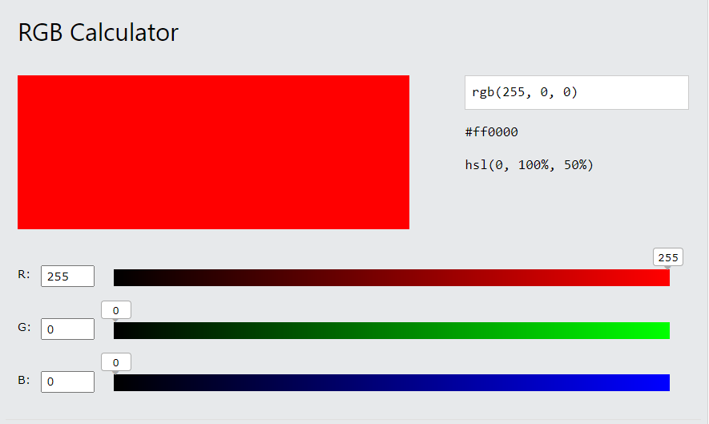

<https://www.w3schools.com/colors/colors_rgb.asp>

---

## Colori - HEX

Un colore HEX è la rappresentazione esadecimale di un colore RGB\, usando la seguente griglia

__\#RRGGBB__ dove RR è il red\, GG è il green e BB è il blue

Si tratta del valore esadecimale precedentemente rappresentato da 0 a 255

---

## Colori - HEX Calculator

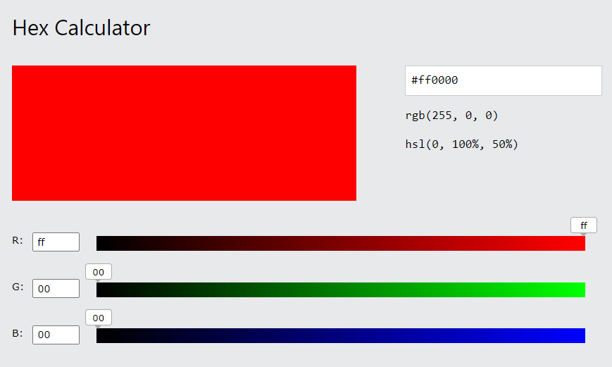

<https://www.w3schools.com/colors/colors_hexadecimal.asp>

---

## Colori - HSL

HSL è acronimo di hue\, saturation e lightness \(tinta\, saturazione e luminosità\)

HSLA è la variante con Alpha channel

Hue è il grado di colore in una ruota da 0 a 360: 0 è il rosso\,120 il verde e 240 il blue\.

Saturation è una percentuale da 0% che identifica un’ombra grigia e  100% che rappresenta il colore pieno\.

Lightness è a sua volta una percentuale che va dal 0% che è il nero a 100% che è il bianco\.

---

## Colori - HSL Calculator

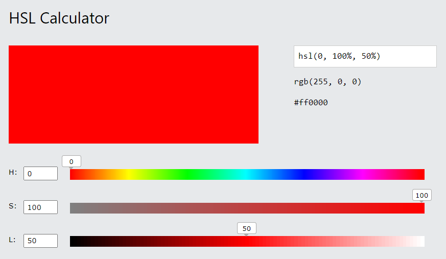

<https://www.w3schools.com/colors/colors_hsl.asp>

---

## Cos'è il CSS?

CSS è acronimo di  __Cascading Style Sheets__\, sono fogli che vengono utilizzati per formattare le pagine web\.

Con i CSS è possibile controllare il colore\, il carattere\, la dimensione del testo\, la spaziatura tra gli elementi\, il modo in cui gli elementi sono posizionati e disposti\, quali immagini di sfondo o colori di sfondo devono essere utilizzati\, o le diverse visualizzazioni in base alle dimensioni dello schermo

Da notare che  __cascading__ identifica il fatto che uno stile applicato a un elemento padre si applicherà anche a tutti gli elementi figli all'interno dell'elemento padre

---

## CSS

I CSS possono essere aggiunti ai documenti HTML in 3 modi:

Inline \- utilizzando l'attributo style all'interno degli elementi HTML

Interno \- utilizzando un elemento \<style> nella sezione \<head>

Esterno: utilizzando un elemento \<link> per collegarsi a un file CSS esterno

---

## CSS Inline

    <h1 style="color:blue;">Una intestazione blue</h1>

    <p style="color:red;">Un paragrafo rosso</p>

---

## CSS Interno

...

    <head>

    <style>

    body {background-color: powderblue;}

    h1   {color: blue;}

    p    {color: red;}

    </style>

    </head>

...

---

## CSS Esterno

...

    <head>

        <link rel="stylesheet" href="styles.css">

    </head>

...

---

## styles\.css

    body {

        background\-color: powderblue;

    }

    h1 {

        color: blue;

    }

    p {

        color: red;

    }

---

## Link

I link HTML sono collegamenti ipertestuali\.

Lo scopo è quello di passare da una pagina all’altra

Essendo elementi cliccabili\, quando viene spostato il mouse su un link il puntatore viene trasformato in una piccola mano\.

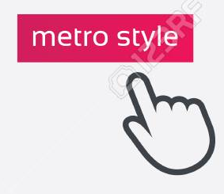

---

## Link - a

Sintassi

Il tag  __\<a>__  ha la seguente sintassi:

__\<a href="url">__ testo del collegamento __\</a>__

L'attributo più importante di  __\<a>__  è l'attributo  __href__ \, che indica la destinazione del collegamento\.

Il testo del collegamento è la parte visibile all’interno della pagina HTML

Facendo clic sul testo del collegamento\, il browser verrà indirizzato all'indirizzo  __URL__

---

## Link - colori

Esiste una convenzione fra browser per visualizzare i collegamenti con un colore diverso\, in base ad alcune caratteristiche

Un collegamento  __non visitato__  è sottolineato e  __blu__

Un collegamento  __visitato__  è sottolineato e  __viola__

Un collegamento  __attivo__  è sottolineato e  __rosso__

Per ottenere l’attivo basta tenere cliccato il mouse sul link

---

## Target

L'attributo di  __target__

Se non indichiamo un  __target__  il browser visualizzerà il link nella pagina corrente\.

Per modificare questo comportamento è necessario specificare un altro  __target__

L'attributo  __target__  può avere uno dei seguenti valori:

__\_self__  \- DEFAULT\. Apre il documento nella stessa finestra/scheda in cui è stato cliccato

__\_blank__  \- Apre il documento in una nuova finestra o scheda

__\_parent__  \- Apre il documento nel frame genitore

__\_top__  \- Apre il documento in tutto il corpo della finestra

__“nomeframe”__ Apre il documento in un determinato frame

---

## Link - esempi

```HTML
<iframe src="http://www.acmenovara.it" name="A">
<p>ACME Novara</p>
</iframe>

<iframe src="https://www.google.com" name="B">
<p>Google.com</p>
</iframe>

<iframe src="https://www.google.it" name="C">
<p>Google.it</p>
</iframe>

<a href="http://www.acmenovara.it" target="B">CAMBIO B</a>
```

---

## Bookmark

Crea un bookmark in HTML

I bookmark possono essere utili se una pagina web è molto lunga\.

Per creare un bookmark: prima occorre creare il bookmark\, poi aggiungere un collegamento ad esso\.

Quando si fa clic sul bookmark\, la pagina scorrerà verso il basso o verso l'alto fino alla posizione del bookmark\.

---

## IMG

Il tag HTML  __\__  viene utilizzato per incorporare un'immagine in una pagina web\.

Le immagini non sono tecnicamente inserite in una pagina web; le immagini sono collegate a pagine web\. Il tag  __\__  crea uno spazio per inserire l'immagine\.

Il tag __\__ è vuoto\, contiene solo attributi e non ha un tag di chiusura\.

Il tag __\__ ha due attributi obbligatori:

__src__  \- Specifica il percorso dell'immagine

__alt__  \- Specifica un testo alternativo per l'immagine

25/2/1993 nasce il tag IMG
<http://1997.webhistory.org/www.lists/www-talk.1993q1/0182.html>

---

## Immagini di sfondo

Tramite l’attributo  __style__  è possibile inserire un’immagine di sfondo ad un elemento grafico

    <div style="background-image:url('https://i.ytimg.com/vi/-cQk6kK7JVs/maxresdefault.jpg');">

    Lorem ipsum dolor sit amet, consectetur adipiscing elit. 
    Donec ante eros, egestas vitae ullamcorper id, dignissim nec ipsum.

    </div>

Testo  __Lorem ipsum__ generato da [https://www\.lipsum\.com/](https://www.lipsum.com/)

---

## Immagini di sfondo - cover

Se volete che l'immagine di sfondo copra l'intero elemento\, si può impostare la proprietà

__background-size: cover__

Inoltre\, per assicurasi che l'intero elemento sia sempre coperto\, basta impostare la proprietà

__background-attachment: fixed__

In questo modo\, l'immagine di sfondo coprirà l'intero elemento\, senza cambiarne le proporzioni

---

## Picture

L'elemento HTML  __\<picture>__  offre una maggiore flessibilità nello specificare le risorse dell'immagine\. Contiene uno o più elementi  __\<source>__, ognuno dei quali si riferisce a diverse immagini tramite l'attributo  __srcset__. In questo modo il browser sceglie l'immagine che meglio si adatta alla visualizzazione e/o al dispositivo corrente.

Ogni elemento  __\<source>__  ha un attributo multimediale che definisce quando l'immagine è la più adatta.

L'elemento  __\__  indicherà il default da usare nel caso non ci siano match corretti.

    <picture>
      <source media="(min-width: 650px)" srcset="computer.jpg">
      <source media="(min-width: 465px)" srcset="tablet.jpg">
      
    </picture> 

---

## Picture - perché?

Quando usare il tag  __\<picture>__?

\- Risparmiare banda

\- Usare immagini ottimizzate

\- Adattare facilmente il contesto alla dimensione del device

---
## MAP

Il tag  __\<map>__  viene usato per definire una mappa di immagini.

Una mappa è un'immagine con delle aree selezionabili

L'attributo  __name__  dell'elemento  __\<map>__  è associato all'attributo  __usemap__  di  __\__  e crea una relazione tra immagine e mappa.

L'elemento  __\<map>__  contiene un numero di elementi  __\<area>__, che definisce le aree cliccabili nella mappa dell'immagine

    

    <map name="workmap">
        <area shape="rect" title="google" coords="0,0,250,300" href="https://www.google.com">
        <area shape="rect" title="bing" coords="250,0,500,300" href="https://www.bing.com">
    </map>

---

## Favicon

Una favicon è una piccola immagine visualizzata accanto al titolo della pagina nella scheda del browser e nel bookmark del browser

Per aggiungere una favicon ad un sito web\, occorre salvarla nella directory principale del server web e chiamarla  __favicon\.ico__

Nel caso sia posizionata o nominata in modo diverso è necessario indicarne il percorso a livello di  __head__

    <head>
        <link rel="icon" type="image/x-icon" href="/images/favicon.ico">
    </head>

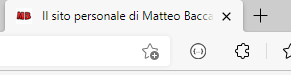

---

## Favicon - come disegnarle

Un sito utilizzabile per disegnare delle favicon è [https://www.favicon.cc/](https://www.favicon.cc/)

Non volendo usare il formato  __ico__  è comunque possibile scegliere fra una serie di altri formati orizzontalmente accettati dai maggiori browser

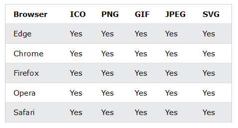

---

## Table

Il tag  __table__ serve a racchiudere delle informazioni rappresentabili in righe e colonne\. Anche se molto utilizzato in passato\, è stato progressivamente superato da altri costrutti responsive\.
Il tag  __table__  contiene da più tag

    table       : tabella
    thead       : area di intestazione tabella
    tbody       : corpo della tabella
    tfoot       : piede della tabella
    tr          : riga
    th          : header
    td          : data
    caption     : titolo
    colgroup    : definizione di colonne
    col         : singolo elemento di definizione di colonna

---

## Table border

Ci sono una serie di proprietà che possono essere utilizzate per personalizzare i tag  __table__, ad esempio

    border: 1px solid black;
    border-collapse: collapse;
    border-radius: 10px;
    border-color: #96D4D4;
    background-color: #96D4D4;

---

## Table width

Con lo  __style__   __width__  è possibile indicare l’occupazione di una singola colonna

```html
<table  style="width:100%" >
    <thead>
        <tr>
            <th style="width:10%">Colonna 1</th>
            <th>Colonna 2</th>
        </tr>
    </thead>
    <tbody>
        <tr>
            <td>Dato 1</td>
            <td>Dato 2</td>
        </tr>
    </tbody>
</table>
```

---

## Table colspan e rowspan

Con lo  __colspan__ e __rowspan__ è possibile indicare che una cella occupa più di una riga o di una colonna

```html
<table>
    <thead> <tr> <th colspan="2" >Colonna 1</th><th>Colonna 2</th> </tr> </thead>
    <tbody>
        <tr> <td  rowspan="2" >Dato 1</td> <td>Dato 2</td> <td>Dato 3</td> </tr>
        <tr> <td>Dato 2</td> <td>Dato 3</td> </tr>
    </tbody>
    <tfoot><tr><td>Piede 1</td><td>Piede 2</td><td>Piede 3</td></tr></tfoot>
</table>
```

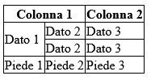

---

## Table caption

Con  __caption__  è possibile dare un titolo a una tabella

Il tab  __caption__ deve essere inserito subito dopo il tag  __table__

\.\.\.

__\<caption> Caption \</caption>__

\.\.\.

---

## Table colgroup col

Con  __colgroup__ e  __col__  è possibile indicare una serie di caratteristiche che la singola colonna deve avere: come un colore o un bordo

Il tab  __col__  può anche avere un attributo che indica quante colonne subiscono il nuovo stile

    <colgroup>
        <col span="2" style="background-color:green;">
        <col style="background-color:blue; border: 5px solid black;">
    </colgroup>

---

## Liste non ordinate

L’utilizzo dei tag  __ul__ e  __li__ permette di definire delle liste non ordinate

Le liste sono rappresentate da una serie di righe contigue evidenziate da un piccolo cerchio nero iniziale

    <ul>
        <li>Primo elemento</li>
        <li>Secondo elemento</li>
        <li>Terzo elemento</li>
    </ul>

---

## Liste ordinate

L’utilizzo dei tag  __ol__ e  __li__ permette di definire delle liste ordinate

Le liste sono rappresentate da una serie di righe contigue numerate

    <ol>
        <li>Primo elemento</li>
        <li>Secondo elemento</li>
        <li>Terzo elemento</li>
    </ol>

---

## Liste descrittive

L’utilizzo dei tag  __dl__, __dt__ e __dd__ permettono di creare delle liste descrittive

Con  __dl__ si definisce la lista\, con  __dt__ si descrive il nome \(term\)\, con  __dd__ si descrive il termine

    <dl>
        <dt>Cornetto</dt>
            <dd>- alla crema</dd>
            <dd>- al cioccolato</dd>
            <dd>- alla marmellata</dd>
        <dt>Latte</dt>
            <dd>- di soia</dd>
            <dd>- di capra</dd>
    </dl>

---

## Blocchi e inline

Esistono due tag generici e abbastanza simili utilizzati per definire delle aree\.

I tag sono  __div__ e  __span__ \.

__DIV__

L’elemento inizia sempre su una nuova riga
Occupa l’intera larghezza disponibile
Ha un margine inferiore e superiore

__SPAN__

Non inizia su una nuova riga
Occupa solo la larghezza necessaria
Non ha un margine superiore e inferiore

---

## Blocchi e inline

La rappresentazione di __DIV__ e __SPAN__ è notevolmente diversa:

Lorem ipsum dolor sit amet\, consectetur adipiscing elit\. __\<div style="background\-color:yellow; border: 1px solid red;">Ciao DIV\</div>__ Praesent laoreet hendrerit neque sed sagittis\.
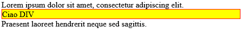

Lorem ipsum dolor sit amet\, consectetur adipiscing elit\. __\<span style="background\-color:yellow; border: 1px solid red;">Ciao SPAN__</span> Praesent laoreet hendrerit neque sed sagittis\.
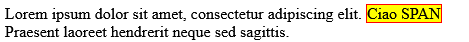

---

## Classi

L’attributo  __class__ serve ad indicare una classe associata ad un qualsiasi tag\.

    <div class="town">
        <h2>Parigi</h2>
        <p>Capitale della federazione dei pianeti uniti, situata sul Quadrante Alfa</p>
    </div>

La classe specificata può poi essere descritta a livello di CSS\.

Da notare che il nome della classe è case sensitive\.

---

## ID

L’attributo  __id__ permette di referenziare un singolo tag in modo univoco\.

Il browser non effettua nessun controllo di univocità sull’ __id__  è quindi a carico di chi crea la pagina assicurarsi che  __id__  sia effettivamente univoco.

Avere un  __id__  ci permette di applicare delle caratteristiche ad un singolo tag e di usarlo in modo più efficiente da parte di codice javascript.

---

## Iframe

Il tag  __iframe__ permette l’inclusione di una pagina all’interno di una pagina HTML

    <iframe src="url" title="descrizione"></iframe> 

L’attributo necessario per il funzionamento di un  __Iframe__  è  __url__ \.

Questo attributo indica l’indirizzo della pagina da includere.

---

## Iframe

__iframe__ ha una serie di attributi che ne condizionano la visualizzazione come:

    <iframe src="https://www.baccan.it/" title="Matteo Baccan" height="200" width="300"></iframe>

    <iframe src="https://www.baccan.it/" title="Matteo Baccan" style="height:200px;width:300px;"></iframe>

__Iframe__ può poi essere utilizzato come target di un tag  __a__

    <iframe src="about:blank" title="Matteo Baccan" name="baccan"></iframe>

    <a href="https://www.baccan.it/" target="baccan">Baccan.it</a>

---

## Script

__script__ è il tag col quale è possibile inserire del codice JavaScript per rendere dinamiche delle pagine HTML.

__script__  può contenere direttamente del codice\, o referenziare una pagina esterna contenente a sua volta del codice.

    <a href="https://www.baccan.it/" id="baccan">Baccan.it</a>

    <script>
        document.getElementById("baccan").innerHTML = "CIAO!!";
    </script>

---

## Path

E’ importante capire come sono gestiti i file in una struttura a cartelle\. La corretta comprensione permette di indirizzare nel modo giusto le varie risorse.

Rispetto alla pagina corrente

                            foto.jpg è nella stessa cartella
                   foto.jpg è nella cartella  immagini
                  foto.jpg è nella cartella  immagini del root folder
                         foto.jpg è nella cartella padre della cartella corrente
         foto.jpg è sul sito foo.bar

---

## Head

__head__  è il tag dove sono contenute una serie di informazioni propedeutiche alla visualizzazione corretta di una pagina e alla sua indicizzazione all’interno di motori di ricerca e social network\.

Nel tag  __head__ sono presenti anche i riferimenti a file esterni\, tipicamente  __css__\.

Altri elementi che entrano a far parte di questo tag sono i tag  __meta__\.

---

## Head

Il set di caratteri usato per la corretta visualizzazione del sito

    <meta charset="UTF-8">

Aggiornamento automatico

    <meta http-equiv="refresh" content="10">

Impostazioni per la visualizzazione responsive

    <meta name="viewport" content="width=device-width, initial-scale=1.0">

---

## Head

Elementi utilizzati dai motori di ricerca

Descrizione

    <meta name="description" content="La mia bellissima pagina">

Keywords

    <meta name="keywords" content="HTML, CSS, JavaScript">

L’autore

    <meta name="author" content="Matteo Baccan">

---
## Open Graph

Altri elementi che si trovano in  __head__  sono quelli del protocollo Open Graph.

<https://ogp.me/>

Il protocollo Open Graph consente a qualsiasi pagina Web di essere arricchita di dati utili ad un “social graph”\. Ad esempio\, questo protocollo viene utilizzato su Facebook per consentire a qualsiasi pagina Web di avere le stesse funzionalità di qualsiasi altro oggetto su Facebook\.

---

## Open Graph

Le quattro proprietà minime per Open Graph sono

__og:title__  : il titolo del vostro oggetto

__og:type__  : il tipo\, ad esempio "video\.movie"

__og:image__  : l’immagine che rappresenta l’oggetto

__og:url__  : l’indirizzo canonico dell’oggetto

---

## Open Graph

Un esempio di utilizzo delle proprietà Open Graph

    <meta property="og:url"             content="https://www.baccan.it" />

    <meta property="og:title"           content="Il sito personale di Matteo Baccan" />

    <meta property="og:description"     content="Scrivo software e aiuto le aziende a scriverne di migliore" />

    <meta property="og:image"           content="https://www.baccan.it/logo/29.png" />

    <meta property="og:type"            content="blog" />

    <meta property="og:site_name"       content="Il sito personale di Matteo Baccan" />

---

## Open Graph

Altri elementi di Open Graph sono

__og:audio__ : l’audio che accompagna questo oggetto
__og:description__ : la descrizione di questo oggetto
__og:determiner__ : la parola che appare prima del titolo all’interno di una frase\. E’ possibile scegliere fra  __a__ \,  __an__ \,  __the__ \,  __""__ \,  __auto__ \)\. Se è scelto  __auto __ il valore sarà scelto fra  __a__  o  __an__ \. Il default è vuoto  __""__  \(blank\)\.
__og:locale__ : è la lingua dell’oggetto\. Se non indicato il default è  __en\_US__ \.
__og:locale:alternate__ : l’elenco di altre lingue nelle quali la pagina è disponibile
__og:site\_name__ : se l’oggetto è parte di un grande sito web\, sarà il nome con il quale verrà referenziato il sito
__og:video__ : l’indirizzo del video in accompagnamento della pagina

---

## Open Graph

Un esempio di uso avanzato di Open Graph preso dalla pagina di  __Gal Gadot__  __[https://www\.imdb\.com/name/nm2933757/](https://www.imdb.com/name/nm2933757/)__  protagonista di “Wonder Woman 1984”

\<meta  __property="og:url"__  content="http://www\.imdb\.com/name/nm2933757/" />
\<meta  __property='og:image'__  content="https://m\.media\-amazon\.com/images/M/MV5BYThjM2NlOTItYTUzMC00ODE3LTk1MTItM2I3MDViY2U3MThlXkEyXkFqcGdeQXVyMTg4NDI0NDM@\.\_V1\_UY1200\_CR165\,0\,630\,1200\_AL\_\.jpg" />
\<meta  __property='og:type'__  content="actor" />

---

## Open Graph

\<meta  __property="og:description"__  content="Gal Gadot\, Actress: Wonder Woman 1984\. Gal Gadot is an Israeli actress\, singer\, martial artist\, and model\. She was born in Rosh Ha'ayin\, Israel\. Her parents are Irit\, a teacher\, and Michael\, an engineer\. She served in the IDF for two years\, and won the Miss Israel title in 2004\. Gal made her film debut in the fourth film of the Fast and Furious franchise\, Fast &amp; Furious \- Solo parti\.\.\." />
\<meta  __property='og:title'__  content="Gal Gadot \- IMDb" />
\<meta  __property='og:site\_name'__ content='IMDb' />

---

## Open Graph

Alcune proprietà Open Graph possono avere delle proprietà aggiuntive\.

Ad esempio  __og:image__  può indicare alcuni dati in riferimento alla propria dimensione.

    og:image:width      Larghezza in pixel
    og:image:height     Altezza in pixel

---

## Responsive

Il responsive web design consiste nel creare pagine web che si adattino a qualsiasi dispositivo

Un responsive web design si adatterà in automatico alle diverse dimensioni dello schermo e viewport

Per poter definire che una pagina è responsive occorre aggiungere una riga nel tag  __head__

    <meta name="viewport" content="width=device-width, initial-scale=1.0">

Questa riga dirà al browser come controllare le dimensioni di pagina

---

## Responsive image

Per rendere una immagine responsive è possibile utilizzare  __max\-width__  che ci permette di indica la dimensione massima che avrà in larghezza ed impostare l’altezza ad  __auto__

     

---

## Responsive image

Un altro elemento responsive che abbiamo visto è il tag  __picture__

    <picture>
        <source media="(min-width: 650px)" srcset="computer.jpg">
        <source media="(min-width: 465px)" srcset="tablet.jpg">
        
    </picture>

---

## Responsive text

Anche gli elementi testuali possono avere delle caratteristiche responsive\.
Per farlo occorre impostare le dimensioni del carattere in  __vw__  che rappresenta il  __viewport width__

Ad esempio proviamo ad impostare la grandezza di  __ciao__  a 10vw

    <div style="font-size:10vw">Ciao</div>

Ingrandendo a diminuendo la dimensione dello schermo il testo si adeguerà di conseguenza\.
Il __viewport width__ è la larghezza della finestra del browser e l’unità __vw__ è il suo percentile

[https://whatismyviewport\.com/](https://whatismyviewport.com/)

---

## Media Query

Un altro modo per adattare le pagine ad una particolare dimensione è l’utilizzo delle media query

In questo modo è possibile cambiare completamente layout\, in base alle dimensioni dello schermo

---

## Media Query

All’interno di una media query è possibile indicare il momento in cui un particolare frammento di CSS deve entrare in gioco

In questo caso\, il CSS viene considerato fino alla larghezza di 800px

    @media screen and (max-width: 800px) {
        /* CSS */
    }

---

## Code

Il tag  __code__ permette di evidenziare del testo in modo possa essere usato per la rappresentazione di codice\, ad esempio usando un font non proporzionale

    <code>
        x = 1;
        y = 2;
        z = x + y;
    </code>

Il comportamento è simile all’uso di un tag  __span__ con font  __courier__

---

## kbd

Il tag  __kbd__ permette di evidenziare una sequenza di tasti da premere: l’aspetto è simile a quello di  __code__

    <p>Visualizza il sorgente premendo <kbd>Ctrl + U</kbd></p>

Il comportamento è simile all’uso di un tag  __span__ con font  __courier__

---

## samp

Il tag  __samp__ permette di simulare l’output di un programma

    <p>Esempio di output:</p>
    <p><samp>Hello world.<br>Premi F1 per continuare</samp></p>

---

## pre

Il tag  __pre__ permette di mantenere la formattazione presente all’interno di un testo

    <pre>
        x = 1;
        y = 2;
        z = x + y;
    </pre>

---

## var

Il tag  __var__ evidenzia una variabile o una espressione

    L’area del rettangolo è <var>b</var> per <var>a</var>, dove <var>b</var> è la base e <var>a</var> è l’altezza

---

## Layout

HTML ha diversi tag semantici che definiscono le diverse parti di una pagina\.

Questi elementi permettono una standardizzazione del codice verso una serie di elementi comuni

    <header> - Intestazione o sezione di un documento
    <nav> - Link di navigazione
    <section> - Sezioni
    <article> - Un contenuto
    <aside> - Una sidebar
    <footer> - Il piede del documento o di una sezione
    <details> - Dettagli aggiuntivi rispetto al documento
    <summary> - Un header dell’elemento <details>

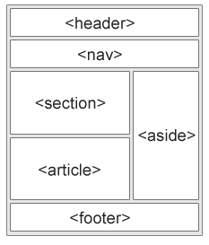

---

## Layout

Esistono tecniche diverse per posizionare questi tag

- L’uso di framework CSS come Bootstrap

- L’uso delle proprietà  __float__ e  __clear__

- L’uso di Flexbox \(1\)

- L’uso di Grid Layout \(2\)

<https://caniuse.com/flexbox>
<https://caniuse.com/css-grid>

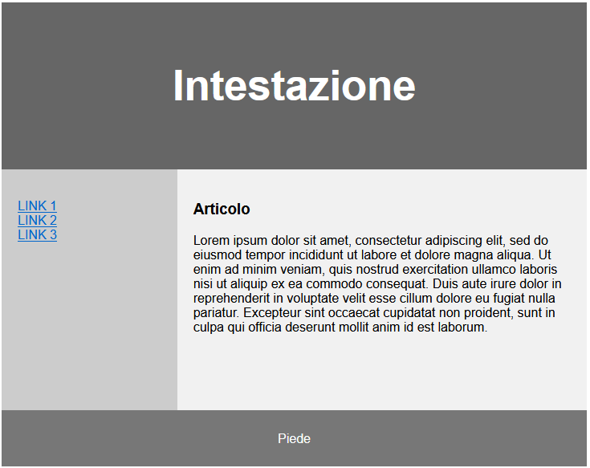

---

## Validazione

Per verificare che il proprio codice HTML/CSS sia valido è possibile usare dei siti di validazione codice

Il più conosciuto è il validatore di w3\.org\, che è in grado di darci segnalazione di tutte le anomalie presenti nel nostro codice\. Esistono però delle valide alternative

[https://validator\.w3\.org](https://validator.w3.org/)
[https://html5\.validator\.nu](https://html5.validator.nu/)

In alternativa esistono dei plugin utilizzabili direttamente da browser\, come  __html\-validator__  per Chrome

<https://chrome.google.com/webstore/detail/html-validator/mpbelhhnfhfjnaehkcnnaknldmnocglk>

---

## Validazione cross device

Esistono una serie di siti web che permettono di verificare che il proprio sito venga visualizzato correttamente su una serie di device\.

Alcuni di più famosi sono

[https://www.browserstack.com](https://www.browserstack.com/)
[https://www.browserling.com](https://www.browserling.com/)

---

## Validazione cross device

Browserstack richiede una registrazione per poter usare la versione gratuita e mette a disposizione una simulazione su device reali per sistemi operativi Windows\, Mac\, IOS e Android


---

## Validazione cross device

Browserling permette 1 minuto di navigazione su una serie di sistemi operativi e versioni di browser


---

## Entity

Esistono una serie ci caratteri riservati che non possono essere inseriti all’interno di una pagina HTML\.

Ad esempio i caratteri \< e > che rappresentano l’inizio e la fine di un  __tag\.__

Per superare questa limitazione è possibile ricorrere alle entity\, che rappresentano una sintassi con la quale indicare la rappresentazione di un carattere riservato\.

Una entity è rappresentabile in 2 modi differenti\, tramite

__&nome\_entity;__

Oppure

__&\#numero\_entity;__

---

## Entity

Di seguito una serie di entity largamente diffuse

        non-breaking space                      &nbsp;      &#160;
    <   less than                               &lt;        &#60;
    >   greater than                            &gt;        &#62;
    &   ampersand                               &amp;       &#38;
    "   double quotation mark                   &quot;      &#34;
    '   single quotation mark (apostrophe)      &apos;      &#39;
    ¢   cent                                    &cent;      &#162;
    £   pound                                   &pound;     &#163;
    ¥   yen                                     &yen;       &#165;
    €   euro                                    &euro;      &#8364;
    ©   copyright                               &copy;      &#169;
    ®   registered trademark                    &reg;       &#174;

---

## Entity - simboli

Oltre ai caratteri riservati\, esistono una serie di caratteri non riproducibili da tastiera\, anche loro sono rappresentabili con delle entity

Un esempio sono i simboli matematici

    ∀ 	&#8704; 	&forall;        FOR ALL
    ∂ 	&#8706; 	&part;          PARTIAL DIFFERENTIAL
    ∃ 	&#8707; 	&exist;         THERE EXISTS
    ∅ 	&#8709; 	&empty;         EMPTY SETS
    ∇ 	&#8711; 	&nabla;         NABLA
    ∈ 	&#8712; 	&isin;          ELEMENT OF
    ∉ 	&#8713; 	&notin;         NOT AN ELEMENT OF
    ∋ 	&#8715; 	&ni;            CONTAINS AS MEMBER
    ∏ 	&#8719; 	&prod;          N-ARY PRODUCT
    ∑ 	&#8721; 	&sum;           N-ARY SUMMATION

---

## Entity - simboli non riproducibili

Oltre ai caratteri riservati\, esistono una serie di caratteri non riproducibili da tastiera\, anche loro sono rappresentabili con delle entity

Un esempio sono i simboli matematici

    ∅ 	&#8709; 	&empty;     Vuoto
    ∈ 	&#8712; 	&isin;      Contenuto
    ∉ 	&#8713; 	&notin;     Non contenuto

Per un elenco completo è possibile utilizzare questo indirizzo

[https://www.w3schools.com/charsets/ref_utf_math.asp](https://www.w3schools.com/charsets/ref_utf_math.asp)

---

## Entity - emoji

Le entity possono rappresentare\, non solo caratteri\, ma anche emoji\, che vengono visualizzate come piccole immagini\, pur non essendolo\.

Le emoji sono caratteri provenienti dal charset Unicode UTF\-8 e sono sottoposte ad uno standard che si aggiorna in modo periodico

L’accortezza da avere per poter visualizzare i caratteri nel modo corretto è che la pagina inizi col metatag

    <meta charset="UTF-8">

<https://www.fileformat.info/info/charset/UTF-8/list.htm>

---

## Entity - emoji esempi

Di seguito alcuni esempi di emoji

    ✔	&#10004;	2714
    ✖	&#10006;	2716
    ✝	&#10013;	271D
    ✡	&#10017;	2721
    ✨	&#10024;	2728
    ✳	&#10035;	2733
    ✴	&#10036;	2734
    ❄	&#10052;	2744

Per un elenco completo è possibile utilizzare questo indirizzo

[https://www.w3schools.com/charsets/ref_emoji.asp](https://www.w3schools.com/charsets/ref_emoji.asp)

---

## Entity - emoji - rendering

Essendo immagini\, specificate tramite caratteri\, le emoji vengono rappresentate diversamente in base al sistema operativo\, sito web o applicazione che le rappresenta\.

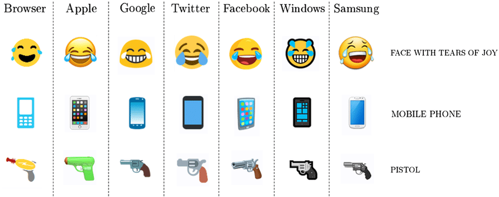

<https://www.researchgate.net/figure/Seven-dierent-implementations-of-three-dierent-Emoji-The-face-with-tears-of_fig16_316168050>

---

## Entity - emoji – tonalità della pelle

Alcune emoji permettono di cambiare il colore della pelle\, per farlo si pone\, dopo l’entity della emoji\, un entity di colorazione

    &#127999; 🏿 Carnagione scura
    &#127998; 🏾 Carnagione abbastanza scura
    &#127997; 🏽 Carnagione media
    &#127996; 🏼 Carnagione abbastanza chiara
    &#127995; 🏻 Carnagione chiara

---

## Entity - emoji – esempi di tonalità della pelle

Di conseguenza\, se vogliamo colorare diversamente l’emoji della mano faremo

    &#9757; Nessun tono della pelle
    &#9757;&#127999; Scuro
    &#9757;&#127998; Medio Scuro
    &#9757;&#127997; Medio
    &#9757;&#127996; Luce media
    &#9757;&#127995; Luce

---

## Form

Un form HTML serve a raccogliere l'input dell'utente\.

__Form__ è tag che inizia e finisce una maschera di acquisizione dati

    <form action="/action.php">
        <label for="fname">Nome:</label>
        <input type="text" id="fname" name="fname" value="Matteo">
        <label for="lname">Cognome:</label>
        <input type="text" id="lname" name="lname" value="Baccan">
        <input type="submit" value="conferma">
    </form>

---

## Form attributi

Il tag  __form__ ha una serie di attributi che ne modificano il comportamento

__target__ si comporta analogamente al target inserito all’interno di un tag  __a__

__method__ è il metodo col quale i parametri devono essere passati alla chiamata http di conferma\. Normalmente i metodi sono  __get__  o  __post__ \. Se non indicato il default è  __get__\. Ci sono delle implicazioni a livello di sicurezza e di gestione di cui tener conto quando viene scelto il metodo per inviare i dati

__autocomplete__ è una indicazione che viene data al browser\, che indica se automatizzare il completamento dei campi con dati che sono stati precedentemente digitati

__novalidate__ indica che i dati inseriti non devono essere validati al loro salvataggio

---

## Form elementi

Esistono più tag che rappresentano il modo col quale inserire dati in una form\.

Ognuno di essi ha delle proprie caratteristiche di utilizzo

    <input>
    <label>
    <select>
    <textarea>
    <button>
    <fieldset>
    <legend>
    <datalist>
    <output>
    <option>
    <optgroup>

---

## Form input

Il tag  __input__ è il primo tag utilizzato e serve ad inserire dei campi testuali monoriga\. Normalmente si lega ad un tag  __label__  che rappresenta la sua descrizione

    <label for="fname">Nome:</label>

    <input type="text" id="fname" name="fname">

---

## Form input type

Uno degli attributi più interessanti di  __input__ è type\, che identifica il tipo di dati che verranno inseriti nel campo

    button    checkboxcolor    date    datetime    datetime-local    email
    file    hidden    image    month    number    password    radio
    range    reset    search    submit    tel    text    time    url    week

---

## CSS Framework

Per facilitare la scrittura di pagine HTML sono nati col tempo una serie di framework CSS utili a velocizzare il lavoro

Fra i framework più noti ci sono

    Boostrap
    Foundation
    Bulma
    Tailwind
    Uikit
    Milligram
    Pure CSS
    Tachyons
    Materialize CSS

---

## Bootstrap

Cos'è Bootstrap?

Bootstrap è un framework front\-end gratuito\, progettato per essere mobile first

Bootstrap include modelli di progettazione basati su HTML e CSS per tipografia\, moduli\, pulsanti\, tabelle\, navigazione\, modali\, caroselli di immagini e molti altri\, oltre a plug\-in JavaScript opzionali

Bootstrap ti dà anche la possibilità di creare facilmente design reattivi

---

## Bootstrap - container

Boostrap fornisce 2 classi per definire un container

__\.container__

che fornisce un contenitore reattivo a larghezza fissa

__\.container\-fluid__

che fornisce un contenitore a larghezza intera\, che copre l'intera larghezza della finestra

---

## Bootstrap - grid

Il sistema a griglia di Bootstrap è costruito con flexbox e consente fino a 12 colonne nella pagina\.

Se non desideri utilizzare tutte e 12 le colonne singolarmente\, puoi raggruppare le colonne insieme per creare colonne più larghe

---

## Bootstrap \- grid

il sistema a griglia Bootstrap 5 ha sei classi:

    .col- (dispositivi extra piccoli - larghezza dello schermo inferiore a 576px)

    .col-sm- (piccoli dispositivi - larghezza dello schermo uguale o superiore a 576px)

    .col-md- (dispositivi medi - larghezza dello schermo uguale o superiore a 768px)

    .col-lg- (dispositivi di grandi dimensioni - larghezza dello schermo uguale o superiore a 992px)

    .col-xl- (dispositivi xlarge - larghezza dello schermo uguale o superiore a 1200px)

    .col-xxl- (dispositivi xxlarge - larghezza dello schermo uguale o superiore a 1400px)

Le classi di cui sopra possono essere combinate per creare layout più dinamici e flessibili\.

---

## Bootstrap \- table

Boostrap dispone di classi predisposte per la visualizzazione dei tag  __table__

Per utilizzarle è sufficiente indicarle a livello di attributo  __class__

    <table class="table">
    </table>

    <table class="table table-striped">
    </table>

    <table class="table table-hover">
    </table>

    <table class="table table-bordered">
    </table>

[https://getbootstrap.com/docs/5.0/content/tables/](https://getbootstrap.com/docs/5.0/content/tables/)

---

## Bootstrap \- testi

Boostrap modifica lo stile standard dei tag tipografici\, come  __h1\, h2\, h3 \.\. h6__ \, ma soprattutto aggiunge una serie di classi per la formattazione dei testi:

    .text-start             Allinea il testo a sinistra
    .text-center            Allinea al centro
    .text-decoration-none   Rimuove la sottolineatura da un collegamento
    .text-end               Allinea a destra
    .text-nowrap            Evita il ritorno a capo
    .text-lowercase         Minuscolo
    .text-uppercase         Maiuscolo
    .text-capitalize        Iniziale in maiuscolo

---

## Bootstrap – colori testo

Boostrap aggiunge una serie di classi utili per raggruppare dei contesti in base ai colori\. Queste classi possono essere sovrascritte da template CSS integrativi

    .text-muted
    .text-primary
    .text-success
    .text-info
    .text-warning
    .text-danger
    .text-secondary
    .text-white
    .text-dark
    .text-body
    .text-light

---

## Bootstrap – colori sfondo

Boostrap anche gli sfondi hanno delle colorazioni contestuali

    .bg-primary
    .bg-success
    .bg-info
    .bg-warning
    .bg-danger
    .bg-secondary
    .bg-dark
    .bg-light

---

## Bootstrap – immagini

Per quanto riguarda le immagini\, sono state introdotte una serie di classi che aiutano la loro visualizzazione e allineamento

    .rounded                Arrotonda gli angoli dell’immagine
    .rounded-circle         Mette l’immagine in un cerchio
    .img-thumbnail          Mette un bordo all’immagine
    .float-start            Allinea a sinistra
    .float-end              Allinea a destra
    .mx-auto (margin:auto) ed .d-block (display:block)      Permettono la centratura
    .img-fluid              Crea un’immagine responsive applicando
                            max-width: 100%; e height: auto;

---

## Bootstrap – Jumbotron

jumbotron è un grande box con lo scopo di richiamare l'attenzione su alcuni contenuti

    <div class="jumbotron">

        <h1>Titolo</h1>

        <p>testo testo testo testo testo testo testo testo testo testo </p>

    </div>

---

## Bootstrap – Alert

Le classi di alert servono ad evidenziare un testo utilizzando un contesto\, come nel caso dei testi

    <div class="alert alert-success">
        <strong>SUCCESSO</strong> hai fatto qualcosa di perfetto
    </div>

Le tipologie di classi di alert si sovrappongono a quelle già viste per i testi

    .alert-success .alert-info .alert-warning .alert-danger
    .alert-primary .alert-secondary .alert-light .alert-dark

Come classi di supporto agli alert è possibile anche usare

    .alert-dismissible	Alert chiudibile
    .fade .show		Alert con un fade in chiusura

---

## Bootstrap – Button

Come per testi e alert\, anche i button hanno delle classi relative al contesto

    <button type="button" class="btn">Basic</button>
    <button type="button" class="btn btn-primary">Primary</button>
    <button type="button" class="btn btn-secondary">Secondary</button>
    <button type="button" class="btn btn-success">Success</button>
    <button type="button" class="btn btn-info">Info</button>

Le tipologie di classi di btn si sovrappongono a quelle già viste per i testi

    .btn-success .btn-info .btn-warning .btn-danger .btn-primary .btn-secondary .btn-light .btn-dark

Come classi di supporto è possibile usare le stesse classi con aggiunta di  __outline__

    .btn-outline-primary .btn-outline-secondary ...

---

## Bootstrap – Badge

I badge sono delle etichette di testo che subiscono il contesto come button e text

    <h1>Esempio di intestazione <span class="badge bg-secondary">badge</h1>

In questo caso il suffisso da usare è __bg__

La classe di supporto dei badge è

__rounded\-pill__ 	Arrotonda i bordi del badge

---

## Bibliografia

<https://mahipal.dev/web-browser-engine-overview-for-beginners> : spiegazione delle strutture del browser
<https://www.oreilly.com/library/view/learning-php-mysql/9781449337452/ch01s01.html> : browser flow
<https://www.w3schools.com> : vari esempi e spunti

---

## Disclaimer

L'autore ha generato questo testo in parte con GPT-3, il modello di generazione del linguaggio su larga scala di OpenAI. Dopo aver generato la bozza della lingua, l'autore ha rivisto, modificato e rivisto la lingua a proprio piacimento e si assume la responsabilità  ultima del contenuto di questa pubblicazione.

L'immagine di sfondo è stata generata con <https://app.haikei.app>